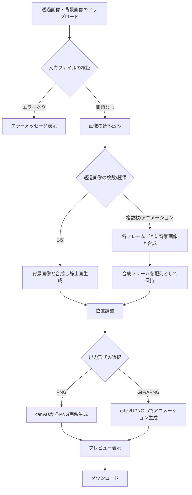

# ポスト画像生成ツール 要件定義

## 1. 背景

- 制作しているゲームの広報活動用に、X（旧Twitter）などSNSで発信する際に利用する画像生成ツールが必要。

---

## 2. 機能要件

### 2.1 基本機能

- **静止画合成**
  - 透過画像（1枚）と背景画像（1枚）から、合成PNG画像を出力する。
- **アニメーション合成**
  - 透過画像（複数枚の連番画像、またはアニメーション画像）と背景画像（1枚）から、合成アニメーション画像（GIF/APNG）を出力する。

### 2.2 オプション機能

- **透過画像の位置調整**
  - デフォルトは背景中央に配置し、必要に応じてX,Y座標で位置を調整できる。

---

## 3. 非機能要件

- **操作性**: Webアプリケーション（SPA）としてGUIで操作可能とする。
- **対応ファイル形式**
  - 入力：PNG（透過）, JPEG, GIF, APNG
  - 出力：PNG（静止画）, GIF, APNG（アニメーション）
- **パフォーマンス**:
  - 数枚〜十数枚程度の連番画像を合成しても実用的な速度で動作すること。
  - 大きな画像や多数のフレームを扱う場合は、処理中であることがわかるUI（プログレスバー等）を表示する。
- **サポートブラウザ**:
  - Chrome / Edge / Firefox の最新版をサポートする。
  - Safariは使用技術の互換性を考慮し、対応可能なバージョンを別途定義する。
- **アクセシビリティ**:
  - WCAG (Web Content Accessibility Guidelines) 2.1 のレベルAA準拠を目指す。

---

## 4. 処理フロー

---

## 5. 使用技術

- **開発言語**: TypeScript
- **ビルド・開発環境**: Vite
- **UIフレームワーク**: React（SPA、1ページ構成）
- **UIコンポーネントライブラリ**: MUI
- **画像処理**: ブラウザ標準の `canvas` API
- **アニメーション生成**:
  - GIF: `gif.js`
  - APNG: `UPNG.js`
- **デプロイ**: Vercel, Netlify, GitHub Pages等の静的サイトホスティングサービス

---

## 6. 設計詳細

### 6.1 UI/UX

- 透過画像・背景画像のアップロードUIを設ける。
- 合成結果をリアルタイムでプレビュー表示する。
- 出力形式（PNG/GIF/APNG）を選択するUIを設ける。
- 生成した画像をダウンロードするボタンを設ける。

### 6.2 入力仕様

- 画像サイズ・解像度はユーザーが任意に指定可能とする。
- アニメーション画像（GIF/APNG）も入力として受け付ける。

### 6.3 出力仕様

- アニメーションのフレームレートを最大30fpsの範囲で指定可能とする (`input type="number"` 等）。
- アニメーションのループは無限ループとする。
- 出力品質（圧縮率）をスライダー等のUIで調整可能とする。

### 6.4 位置調整

- 透過画像の貼り付け位置は、背景の中央を基準とする。
- 調整単位はピクセル単位とする。

### 6.5 エラー処理

- ファイル形式やサイズ超過などのエラーが発生した場合、`<dialog>`要素を用いてユーザーに通知する。

---

## 7. セキュリティ要件

本ツールはクライアントサイドで処理が完結することを前提とし、以下の点に留意する。

- **ファイル検証**: アップロード時に、許可された画像フォーマット（MIMEタイプ）以外のファイルを受け付けないようにする。また、ブラウザがクラッシュしないよう、極端に大きなファイルサイズには警告を表示する。
- **XSS対策**: ファイル名などを画面に表示する際は、サニタイズ処理を行う。
- **依存ライブラリ**: npmパッケージ等の依存ライブラリに脆弱性がないか定期的に確認する。

---

## 8. 品質保証

- **単体テスト**: `Vitest` と `React Testing Library` を用い、主要なコンポーネントやロジックのテストを記述する。
- **E2Eテスト**: `Playwright` を用い、ファイルアップロードからダウンロードまでの一連の操作を自動テストする。

---

## 9. 今後の拡張案（任意）

- 画像の回転や反転
- テキストやロゴの追加
- 複数背景への一括合成
- 透過画像の整数倍拡大機能

---

## 10. ロゴ・クレジット表記

（TBD）

---

## 11. 利用規約・プライバシーポリシー

（TBD）
